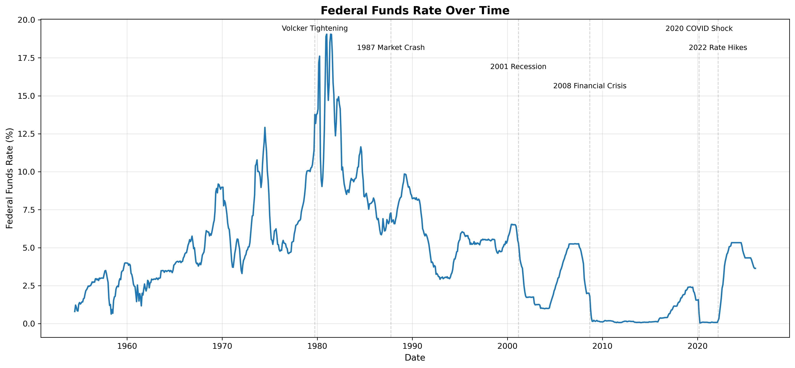
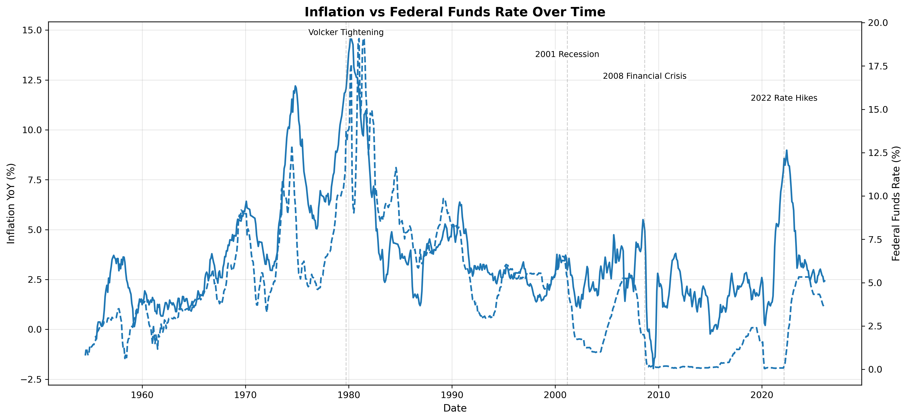
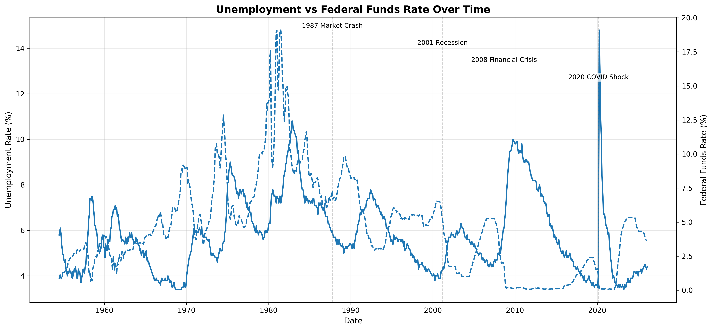
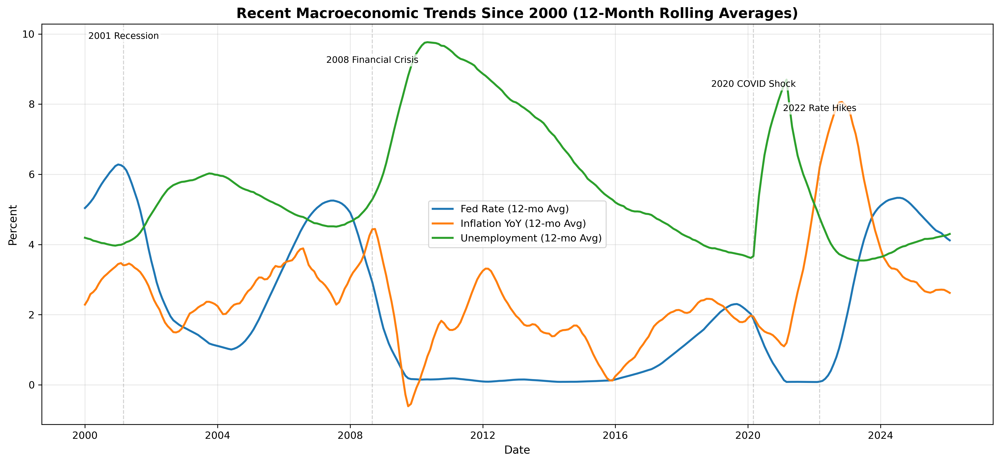

# 📊 U.S. Monetary Policy & Macroeconomic Analysis


---

## 🧠 Overview

This project analyzes the **Federal Funds Rate alongside key macroeconomic indicators**, including inflation and unemployment, to understand how U.S. monetary policy responds to changing economic conditions over time.

Using time-series analysis, statistical modeling, and event-based visualization, the project explores long-term policy trends, macroeconomic relationships, and modern economic dynamics.

---

## 🎯 Objectives

* Analyze long-term trends in the Federal Funds Rate
* Examine relationships between interest rates, inflation, and unemployment
* Identify monetary policy cycles and economic regimes
* Incorporate statistical analysis to quantify relationships
* Enhance interpretation through event-based storytelling

---

## 💼 Business Relevance

Understanding how interest rates respond to inflation and unemployment is critical across finance, policy, and business strategy.

This analysis demonstrates how macroeconomic indicators can be evaluated together rather than in isolation. A multi-variable perspective helps:

* **Financial analysts** assess interest rate environments and macroeconomic risk
* **Policy analysts** evaluate Federal Reserve decision-making
* **Business leaders** anticipate changes in borrowing costs and economic conditions

By combining visualization and statistical analysis, this project provides a more decision-oriented view of monetary policy.

---

## 🛠️ Tools & Technologies

* Python
* Pandas
* NumPy
* Matplotlib
* Seaborn
* Statsmodels
* Jupyter Notebook

---

## 📊 Key Visualizations

### Federal Funds Rate Over Time



### Inflation vs Federal Funds Rate



### Unemployment vs Federal Funds Rate



### Recent Macroeconomic Trends (Since 2000)



---

## 📈 Analytical Methods

This project combines exploratory data analysis, time-series visualization, and statistical modeling to evaluate monetary policy behavior.

Methods include:

* Data cleaning and preprocessing
* Time-series trend analysis
* Rolling averages to smooth volatility
* Event-based annotation to connect economic context to policy shifts
* Correlation analysis
* Linear regression modeling

---

## 📊 Statistical Analysis

To complement visual analysis, this project includes statistical methods to quantify relationships between variables.

### Techniques Used

* **Correlation matrix** to evaluate directional relationships
* **Linear regression model:**
  Federal Funds Rate ~ Inflation + Unemployment

### Why This Matters

Visual trends provide intuition, but statistical analysis strengthens the project by measuring relationships between variables. This helps move the analysis beyond descriptive insights and toward a more analytical framework.

---

## 🔍 Key Insights

* The Federal Funds Rate exhibits clear long-run policy regimes
* Higher inflation environments are often associated with tighter monetary policy
* Lower-rate environments frequently align with weaker labor market conditions
* Monetary policy reflects trade-offs between inflation and employment
* Recent decades show prolonged low-rate periods and gradual policy adjustments

---

## 🧭 Key Takeaway

Monetary policy is best understood as a balancing act between inflation control and labor market stability. Interest rate movements should be evaluated alongside macroeconomic conditions rather than in isolation.

This project demonstrates how combining multiple variables, statistical analysis, and contextual event annotation leads to a more complete understanding of policy behavior.

---

## 📂 Project Structure

```text
us-monetary-policy-analysis/
├── data/
│   └── macro_dashboard_clean.csv
├── images/
│   ├── repo_banner.png
│   ├── rate_levels_over_time.png
│   ├── inflation_vs_fed_rate.png
│   ├── unemployment_vs_fed_rate.png
│   └── recent_macro_trends.png
├── notebooks/
│   ├── 01_data_preparation_and_eda.ipynb
│   └── 02_visual_analysis_and_interpretation.ipynb
├── reports/
│   └── summary_report.md
├── data_dictionary.md
├── requirements.txt
└── README.md
```

---

## 🚀 How to Run

```bash
pip install -r requirements.txt
```

Then open:

```text
notebooks/01_data_preparation_and_eda.ipynb
notebooks/02_visual_analysis_and_interpretation.ipynb
```

---

## 📌 Data Source

Macroeconomic dataset including:

* Federal Funds Rate
* Consumer Price Index (CPI)
* Inflation (Year-over-Year)
* Unemployment Rate

---

## ⚠️ Limitations

* The analysis is exploratory and does not establish causality
* Additional macroeconomic drivers are not included
* Some early-period inflation values are missing
* Monthly data may smooth short-term policy changes
* The regression model is simplified and not intended for forecasting

---

## 🚀 Next Steps

* Expand dataset with additional macroeconomic indicators
* Apply advanced time-series and predictive models
* Segment analysis by monetary policy regimes
* Incorporate recession indicators and economic cycles
* Develop an interactive dashboard for exploration

---

## 👤 Author

**Christina Foy-Bowman**
Aspiring Data Analyst | M.S. in Data Analytics (In Progress)

