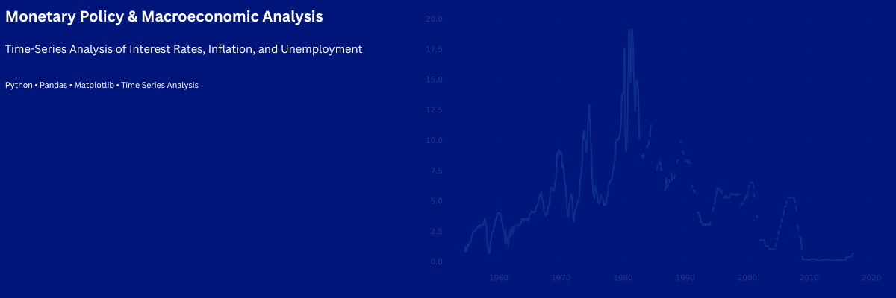

# 📊 U.S. Monetary Policy & Macroeconomic Analysis



## 🧠 Overview

This project analyzes the **Federal Funds Rate alongside key macroeconomic indicators**, including inflation and unemployment, to understand how U.S. monetary policy responds to changing economic conditions over time.

Using time-series analysis and visualization techniques, the project explores long-term trends, policy cycles, and relationships between major economic variables.

---

## 🎯 Objectives

* Analyze long-term trends in the Federal Funds Rate
* Examine relationships between interest rates, inflation, and unemployment
* Identify monetary policy cycles and economic regimes
* Visualize modern macroeconomic trends using rolling averages

---

## 🛠️ Tools & Technologies

* Python
* Pandas
* NumPy
* Matplotlib
* Seaborn
* Jupyter Notebook

---

## 📂 Project Structure

```text
federal-interest-rate-analysis/
├── data/
│   └── macro_dashboard_clean.csv
├── images/
│   ├── repo_banner.png
│   ├── rate_levels_over_time.png
│   ├── inflation_vs_fed_rate.png
│   ├── unemployment_vs_fed_rate.png
│   └── recent_macro_trends.png
├── notebooks/
│   ├── 01_data_preparation_and_eda.ipynb
│   └── 02_visual_analysis_and_interpretation.ipynb
├── reports/
│   └── summary_report.md
├── data_dictionary.md
├── requirements.txt
└── README.md
```

---

## 📊 Key Insights

* The Federal Funds Rate exhibits distinct long-run policy regimes
* Higher inflation environments are often associated with tighter monetary policy
* Lower interest rate periods frequently align with weaker labor market conditions
* Monetary policy reflects trade-offs between inflation control and employment
* Recent decades show prolonged low-rate environments and gradual policy adjustments

---

## 🚀 How to Run

```bash
pip install -r requirements.txt
```

Then open:

```text
notebooks/01_data_preparation_and_eda.ipynb
notebooks/02_visual_analysis_and_interpretation.ipynb
```

---

## 📌 Data Source

Macroeconomic dataset including:

* Federal Funds Rate
* CPI
* Inflation (YoY)
* Unemployment

---

## 💡 Project Highlights

* Structured EDA + analysis workflow
* Multi-variable macroeconomic analysis
* Clean visual storytelling with interpretation
* Reproducible project structure

---

## 👤 Author

Christina Foy-Bowman
Aspiring Data Analyst | MS in Data Analytics (In Progress)
