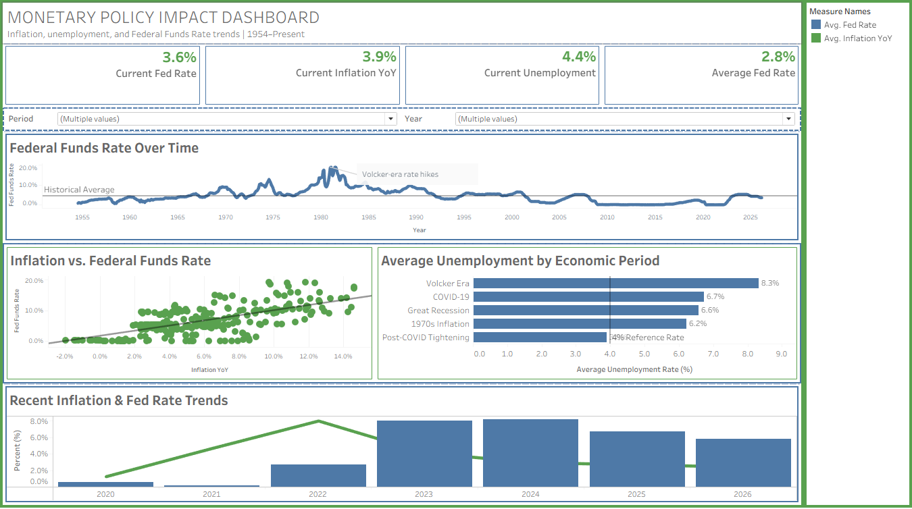

# 📊 U.S. Monetary Policy Analysis | Python, Statistics & Tableau

## Project Overview

This project analyzes long-term U.S. monetary policy and macroeconomic trends using Federal Reserve economic data.

The analysis examines relationships among the Federal Funds Rate, inflation, and unemployment from the 1950s through the present. The project combines Python-based data preparation and exploratory analysis, statistical analysis, and an interactive Tableau dashboard to provide both analytical depth and business-friendly visualization.

## Analytical Questions

This project explores:

- How has the Federal Funds Rate changed across major economic periods?
- How does inflation relate to changes in monetary policy?
- How does unemployment vary during major economic cycles?
- What patterns are visible during periods of aggressive monetary tightening?
- How do recent inflation and interest-rate trends compare with longer-term history?

## Key Findings

### Federal Funds Rate History

The Federal Funds Rate has varied substantially across economic periods, with particularly aggressive tightening during the late 1970s and early 1980s.

The long-term analysis provides context for interpreting current monetary policy relative to historical rate environments.

### Inflation and Monetary Policy

The analysis shows a positive observed relationship between inflation and the Federal Funds Rate.

Periods of elevated inflation have often been associated with higher policy rates as the Federal Reserve responds to inflationary pressure.

### Unemployment Across Economic Periods

Average unemployment differs across major economic periods.

The Volcker Era, COVID-19 period, and Great Recession show higher average unemployment than more recent post-COVID tightening periods.

### Recent Monetary Policy

Recent data show inflation rising sharply after the pandemic, followed by significant increases in the Federal Funds Rate.

Inflation later moderated while interest rates remained elevated relative to the pre-pandemic period.

## Interactive Tableau Dashboard

The Tableau dashboard provides an interactive view of the macroeconomic analysis.

Dashboard features include:

- Current Federal Funds Rate KPI
- Current Inflation YoY KPI
- Current Unemployment KPI
- Average Federal Funds Rate KPI
- Federal Funds Rate history
- Inflation vs. Federal Funds Rate scatter analysis
- Average unemployment by economic period
- Recent inflation and Federal Funds Rate comparison
- Interactive year and economic-period filters

[View Tableau Files](tableau/)

[View Dashboard PDF](tableau/monetary_policy_impact_dashboard.pdf)

## Python Analysis

The Python workflow includes:

- Data cleaning and preparation
- Time-series exploration
- Feature engineering
- Trend analysis
- Correlation analysis
- Statistical interpretation
- Visualization of macroeconomic relationships

The analytical notebooks are available in:

[View Python Notebooks](notebook/)

## Statistical Analysis

The project includes additional statistical analysis examining relationships among inflation, unemployment, and the Federal Funds Rate.

[View Statistical Analysis](statistical_analysis.md)

## Data Source

The project uses Federal Reserve economic data covering:

- Federal Funds Rate
- Consumer Price Index
- Inflation
- Unemployment

The cleaned analytical dataset is stored in:

[data/macro_dashboard_clean.csv](data/macro_dashboard_clean.csv)

Additional field definitions are available in:

[View Data Dictionary](data_dictionary.md)

## Analytical Workflow

1. Collected and prepared macroeconomic time-series data.
2. Cleaned and aligned economic indicators by date.
3. Engineered inflation and related analytical fields.
4. Performed exploratory analysis using Python.
5. Examined statistical relationships among key macroeconomic variables.
6. Created visualizations to identify long-term and recent trends.
7. Developed an interactive Tableau dashboard for business-friendly exploration.
8. Documented findings, methodology, and project structure.

## Tools and Technologies

- Python
- Pandas
- NumPy
- Matplotlib
- Statistical Analysis
- Tableau
- Data Visualization
- Time-Series Analysis
- Exploratory Data Analysis

## Skills Demonstrated

This project demonstrates experience with:

- End-to-end data analysis
- Time-series data preparation
- Statistical analysis
- Correlation analysis
- Feature engineering
- Macroeconomic analysis
- Tableau dashboard development
- Interactive filtering
- Data storytelling
- Translating technical analysis into business-friendly insights

## Repository Structure

    us-monetary-policy-analysis/
    │
    ├── data/
    │   └── macro_dashboard_clean.csv
    │
    ├── images/
    │   ├── monetary_policy_impact_dashboard.png
    │   ├── inflation_vs_fed_rate.png
    │   ├── rate_levels_over_time.png
    │   ├── recent_macro_trends.png
    │   ├── unemployment_vs_fed_rate.png
    │   └── repo_banner.png
    │
    ├── notebook/
    │   ├── 01_data_preparation_and_eda.ipynb
    │   └── 02_visual_analysis_and_interpretation.ipynb
    │
    ├── reports/
    │   └── summary_report.md
    │
    ├── tableau/
    │   ├── monetary_policy_impact_dashboard.twbx
    │   ├── monetary_policy_impact_dashboard.pdf
    │   └── README.md
    │
    ├── data_dictionary.md
    ├── statistical_analysis.md
    ├── requirements.txt
    └── README.md

## Important Interpretation Note

This project is an exploratory macroeconomic analysis. Relationships shown among inflation, unemployment, and the Federal Funds Rate represent observed historical associations and should not be interpreted as proof of direct causation.

## Author

**Christina Foy-Bowman**

Data Analytics | Business Intelligence | AI Evaluation
**Christina Foy-Bowman**
Aspiring Data Analyst | M.S. in Data Analytics (In Progress)

